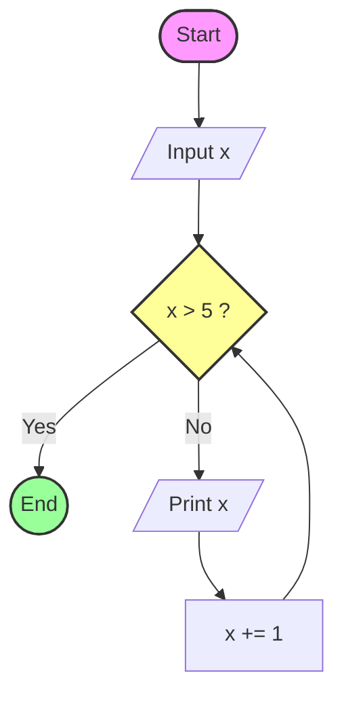

```mermaid
flowchart TD
    A([Start]) --> B[/Input x/]
    B --> C{x > 5 ?}
    C -- Yes --> D((End))
    C -- No --> F[/Print x/]
    F --> G[x += 1]
    G --> C

    style A fill:#f9f,stroke:#333,stroke-width:2px
    style D fill:#9f9,stroke:#333,stroke-width:2px
    style C fill:#ff9,stroke:#333,stroke-width:2px
```